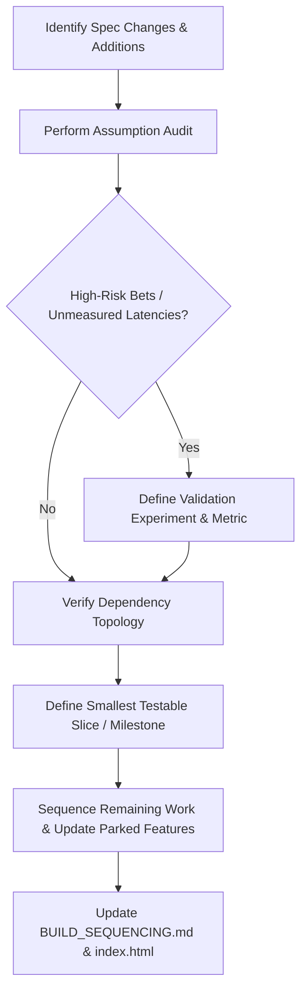

# Lilith v6 — Build Sequencing & Milestone Plan

This document outlines the incremental build sequence and milestone plan for Lilith v6. It converts the unprioritized 29-section design specification into a structured, dependency-ordered pipeline. By prioritizing a **Walking Skeleton (Milestone 1)**, the solo developer can validate critical, high-risk architectural bets (e.g., latency budget, router accuracy) early, before investing months of effort into database plumbing, cross-platform installers, or Google synchronization.

---

## 1. Durable Process for Build Sequencing

As Lilith v6 progresses through ongoing iterative hardening passes, architectural assumptions will change. To prevent spec drift and ensure build order remains aligned with risk reduction, the developer should re-run this sequencing exercise using the following repeatable protocol:



### The Re-Sequencing Protocol
1. **Identify Spec Alterations:** Review changes made in the latest design or review passes.
2. **Perform an Assumption Audit:** Categorize new features or decisions into:
   - *Core/Unvalidated:* High-risk UI/UX or performance assumptions (e.g., local model response quality, voice latency).
   - *Plumbing/Infrastructure:* Required data flow or platform code with low architectural uncertainty.
3. **Establish Validation Gates:** For every core/unvalidated bet, define a quantitative experiment (e.g., measuring p90 latency, keyword routing accuracy) that must pass *before* subsequent layers are built.
4. **Recalibrate the Minimum Shippable Slice:** Ensure the next milestone remains a functional end-to-end loop that the developer can dogfood daily.
5. **Update Parking List:** Explicitly push any non-essential complexity (e.g., secondary endpoints, advanced imports) to post-v1 or future design passes.
6. **Freeze and Document:** Save the new build sequence here and update the reference in [index.html](file:///home/ratatoskyr/Desktop/v6_design_document/index.html).

---

## 2. Milestone 1: The Core Voice Loop Walking Skeleton

The goal of Milestone 1 is to establish the smallest functional, end-to-end voice loop that the developer can immediately use for daily note-taking and voice retrieval. It focuses entirely on a **local voice memory journal** without external cloud oauth setups, bank statement parsing, or complex onboarding.

* **Milestone 1 Objective:** A voice-activated loop (Mic → VAD → STT → LLM → TTS → Speaker) using exactly **one SQLCipher database** (`conversation_db`) and **one tool** (`recall_memory` via FTS5).
* **Developer Daily Use Case:** Dictate notes or summaries to Lilith verbally (which she saves as conversation turns) and ask her questions about past dictations (e.g., *"What did I say yesterday about the concrete mixing ratio?"*). Lilith routes the query, calls the `recall_memory` tool to query the SQLite FTS5 table, and synthesizes a spoken, contextual response.

### 2.1 Section Requirements for Milestone 1

| Section | Status for Milestone 1 | Implementation Scope for Milestone 1 |
|:---|:---|:---|
| **§01 Project Structure & Conventions** | **REQUIRED** | Set up directory layout, standard imports, module boundaries, and `pathlib.Path` defaults. |
| **§02 Security & Credential Management** | **REQUIRED** | Configure `python-keyring` with `master_passphrase` and the Anthropic API key. Insecure fallback checks must be active. |
| **§03 Encryption at Rest — SQLCipher** | **REQUIRED** | Key and mount **exactly one** database: `conversation_db`. Apply the `SessionKeyManager` PRAGMA hex key wrapper. |
| **§04 Cross-Platform Foundations** | **REQUIRED** | Establish basic paths in `platform/paths.py` (Linux default). Native Windows/macOS packing is deferred. |
| **§05 Hardware Detection & Tiers** | **REQUIRED** | Query system capability to decide Whisper execution mode (CPU vs GPU fallbacks). |
| **§06 Process Lifecycle & Recovery** | **REQUIRED** | Single-instance lock (`lilith.lock`) and basic graceful shutdown (close audio stream and single DB). |
| **§07 CI/CD Pipeline** | **EXCLUDED** | Complete local builds only. Defer remote runner verification to Phase 2. |
| **§08 Testing Standards** | **REQUIRED** | Core unit tests for the audio stream, Whisper/Kokoro inference, and `conversation_db` integration. |
| **§09 Audio I/O & Platform Audio APIs** | **REQUIRED** | Mount `sounddevice` input/output streams for mono 16kHz capture and Kokoro audio output chunk queues. |
| **§10 Speech-to-Text (STT)** | **REQUIRED** | Integrate `faster-whisper` and Silero VAD. Silence thresholds and VAD onset/offset must be operational. |
| **§11 Text-to-Speech (TTS)** | **REQUIRED** | Integrate `kokoro-onnx` on CPU. Playback queues must handle streamed audio chunks. |
| **§12 LLM Integration** | **REQUIRED** | Thin Anthropic provider adapter for Claude (BYOK). Caching parameters enabled. |
| **§13 Two-Mode Router** | **REQUIRED** | Deterministic keyword/intent rule classifier to split conversational vs. artifact routes. |
| **§14 Context Window Manager** | **REQUIRED** | System identity (`EDICTS.md` / `VOICE.md`) and the recent history block (up to 1,200 tokens). **Plus the §14 cloud PII tokenization pass on the conversational path** — detector, session-scoped substitution, streaming reverse-substitution with the partial-tag hold rule and unmapped-tag placeholders — so Experiment 1 measures the ≤3 s budget with the real pipeline in place (amended 2026-07-12, SEC-022/NC-4). Task-owned artifact mapping snapshots, re-lock cancellation wiring, and the §08 recall-corpus CI gate remain Phase 3 scope. |
| **§15 Tool System** | **REQUIRED** | Core runner wrapper executing **exactly one** tool: `recall_memory`. |
| **§16 UCL Telemetry** | **EXCLUDED** | Defer the `ucl_db` database. Log telemetry events to standard python logs (`APP_INTERNAL_DIR/logs/dev.log`) for debug. |
| **§17 Enhancement Layers (L1/L2)** | **EXCLUDED** | Defer L1/L2 aggregations. CWM queries conversation history raw or via simple FTS5 search. |
| **§18 Memory System** | **REQUIRED** | Implement the `conversation_db` schema (`turns`, `sessions`) and SQLite FTS5 index. Defer vector embeddings (`memory_db`). |
| **§19 Data Sync Pipeline** | **EXCLUDED** | Calendar/Contacts OAuth sync is fully deferred. |
| **§20 Contacts / People App** | **EXCLUDED** | People database, search tools, and UI screens are deferred. |
| **§21 Finance App** | **EXCLUDED** | Bank statement parsing, transaction lists, and finance tools are deferred. |
| **§22 Conversation / Chat App** | **REQUIRED** | A minimal PySide6 visual window showing conversational bubbles, tool panels, and a typed text input box. |
| **§23 Personality & System Prompt** | **REQUIRED** | Parse static `EDICTS.md` and `VOICE.md` templates into the prompt. Defer local PERS-2 model. |
| **§24 Narrative Layer** | **REQUIRED** | Tool narratives for `recall_memory` in its `tool.yaml` (acknowledge, handoff template, and failure). |
| **§25 Onboarding Flow** | **EXCLUDED** | Defer onboarding UI. Setup and passphrase entry are handled via a local dev CLI command or config file. |
| **§26 Frontend Framework & Shell** | **REQUIRED** | PySide6 application shell and thread-safe `UICommandBus` to dispatch events to the GUI. |
| **§27 The Orb** | **REQUIRED** | A simplified ModernGL widget (basic idle and voice-reactive pulsing). Advanced state migrations are deferred. |
| **§28 Screen Architecture** | **REQUIRED** | Maintain only the `Chat` screen and a basic stubbed `Settings` screen (API key entry). |
| **§29 Vault & Custodian Model** | **EXCLUDED** | Defer cross-device storage, manual uncurated skill CLI enrollment, and complex backups. |

---

## 3. Milestone 1 Validation: High-Risk De-risking Experiments

Before any subsequent design sections are hardened or built, the Milestone 1 codebase must pass two critical de-risking experiments. These tests address the most fragile assumptions highlighted in the design reviews:

### Experiment 1: Walking-Skeleton Latency Benchmark

*Amended 2026-07-12 (SEC-022 / Fool's NC-4): the benchmark now measures the §14 tokenization pipeline's cost explicitly, so the ≤3 s hypothesis is validated with the real pipeline in place, not with a pipeline that will be bolted on later.*

* **Assumption Tested:** Under-3-second response latency on Tier 0 hardware (CPU VAD/STT/TTS + Cloud LLM), **including the §14 cloud PII tokenization and reverse-substitution passes** that §13 names as budgeted steps on the conversational path.
* **Procedure:** Run a test script executing 50 typical voice queries on the developer's laptop with a simulated average network connection. Measure the total time elapsed from voice offset (VAD trigger) to the output stream playing the first synthesized audio chunk. **Run the full 50-query set twice: once with the §14 tokenization pipeline enabled (the shipping configuration) and once with it disabled.** Record per-query timings for both runs and report `tokenization_delta_p50` and `tokenization_delta_p90` — the added cost of the substitution pass, the reverse-substitution stream filter, and any partial-tag holds. The query set must include utterances whose context contains detectable names, emails, and phone numbers, and whose expected responses echo tags back (so reverse substitution and the hold rule are actually exercised, not idled).
* **Pass Criteria:** p90 latency must remain under 3.5 seconds **with tokenization enabled**. The on/off delta has no independent pass bar in v1 — it is recorded so the §13 working-hypothesis numbers are adjusted against measured reality, and it feeds the fallback decision below if the enabled run fails.
* **Architectural Fallback:** If p90 (tokenization enabled) exceeds 3.5 seconds, the developer must:
  1. First check the recorded delta: if the tokenization on/off delta accounts for the overrun, optimize the §14 detector/scanner (both are required to stay single-pass O(context length)) before touching the architecture.
  2. Replace the pre-classification blocking flow with a *stream-and-cut* pattern (initiating cloud stream immediately and shunting to artifact only if a tool keyword is generated).
  3. Implement a soft token cap that allows Claude to gracefully finish a sentence rather than executing a hard truncate at 50 tokens.

### Experiment 2: Router Dry-Run (Counterfactual Instrumentation)

*Amended 2026-07-12 (Fool's Dialectic finding): the dry-run is instrumented as a genuine counterfactual, with a pre-committed quality gate and a named fallback architecture, so the result can falsify the two-mode fork rather than only confirm it.*

* **Assumptions Tested — two, deliberately separated:**
  1. A deterministic rule-based keyword classifier can correctly route inputs without LLM preprocessing (the round-1 question).
  2. Pre-classification actually beats the steelmanned alternative: a **single always-streaming path** that promotes to the artifact lane only on observed evidence (output actually exceeding the budget, or a tool call actually being emitted). The dry-run measures how often single-path would have diverged from the router's pre-classification — per §13's "Milestone-1 counterfactual dry-run instrumentation" and "Named fallback" paragraphs.

* **Utterance Set (assemble before tuning — no training on the test):** A static dataset of 100 realistic developer utterances, authored around a 50/50 conversational/artifact split as a stratification guide. Include known-hard boundary cases: questions conversational in form but long in answer ("how does photosynthesis work?"), tool-needing requests phrased without tool keywords, short factual questions, dictation/note-taking turns, and `recall_memory` queries. The set MUST be assembled and frozen — SHA-256 of the fixture file recorded in the dry-run report — **before any router rule is tuned against dry-run results**. Authored labels are logged for diagnostics only; the measured verdicts below are the ground truth.

* **Procedure (per utterance):**
  1. Run the router's rule pre-classification. Record the decision (`conversational` | `artifact`) and the specific rule that fired.
  2. Run **one** generation through the full Milestone-1 prompt path (CWM as configured, `recall_memory` tool available) with the 50-token cap deliberately **not** enforced: `max_tokens >= 1024`, `temperature 0` for reproducibility. Record:
     - (a) `output_tokens` — the provider-reported completion token count (the same tokenizer the cap would use);
     - (b) `tool_call_emitted` — whether the model actually emitted a tool call;
     - (c) `cap_truncates_mid_sentence` — `true` iff `output_tokens > 50` AND the decoded 50-token prefix, after stripping trailing whitespace, does not end in `.`, `!`, or `?` (optionally followed by a closing quote or parenthesis); `false` by definition when `output_tokens <= 50`.
  3. Derive the per-turn verdict mechanically. Let `needed_artifact := tool_call_emitted OR output_tokens > 50`. Then:

     | Router said | `needed_artifact` | Verdict |
     |:---|:---|:---|
     | conversational | false | `correct_conversational` |
     | artifact | true | `correct_artifact` |
     | artifact | false | `misroute_to_artifact` — trivial turn got the ack/bridge ceremony |
     | conversational | true | `misroute_to_conversational` — answer guillotined (see flag (c)) and/or needed tool lost |

     No judgment call is involved: two people computing verdicts from the same log get the same answer. A generation error is retried once; a persistent failure is recorded as verdict `error` (kept in the denominator, counted as neither correct nor misroute); more than 5 `error` verdicts invalidates the run. The router's endpoint-capability and CWM context-fit conditions are deterministic given state and are out of scope for the verdict — the counterfactual concerns the two per-turn facts single-path would observe: output length and tool need.
  4. Emit one `router.dryrun.utterance` event per turn (utterance_id, mode, rule, output_tokens, tool_call_emitted, cap_truncates_mid_sentence, verdict) and one `router.dryrun.summary` event per run (set_sha256, n, misroute_to_artifact_rate, misroute_to_conversational_rate, total_misroute_rate, threshold_crossed), per §16 naming. During Milestone 1, while `ucl_db` is deferred, emit these through the standard dev-log path as JSON lines; the harness additionally writes a standalone JSONL results file alongside the report.

* **Metric:** With `N` = the full frozen set (nominally 100) as denominator, always reported per direction:
  - `misroute_to_artifact_rate` = count(`misroute_to_artifact`) / N
  - `misroute_to_conversational_rate` = count(`misroute_to_conversational`) / N
  - `total_misroute_rate` = (count(`misroute_to_artifact`) + count(`misroute_to_conversational`)) / N

* **Pre-Committed Threshold (quality gate; committed 2026-07-12, before the utterance set or any router code exists):** The stream-and-cut fallback review is **mandatory** if `total_misroute_rate > 10%` **or** `misroute_to_conversational_rate > 5%`.
  - *Rationale, 10% total:* continuity with this document's original frozen ≥90% routing-accuracy pass criterion — the bar does not move now that the measurement got honest.
  - *Rationale, 5% directional:* misroute-to-conversational is the user-audible failure direction — the turn simply fails (answer cut mid-sentence, or a needed tool never invoked). At >5% that is one audibly broken turn per 20, several per day at dogfooding volume, and tuning the numeric caps cannot fix it because the failure is the fork itself: the router committed to the wrong lane before generation. Misroute-to-artifact costs only seconds of needless ceremony, so it is governed by the total rate alone.
  - *Noise note:* with N=100, if the true directional misroute rate were an acceptable ~2%, the probability of observing >5 such misroutes is under ~2% (binomial) — the gate is unlikely to fire on sampling noise.
  - The gate applies to the first complete run against the frozen set. Tuning rules after a failed run and re-running is expected engineering, but it cannot retroactively cancel a triggered fallback review.

* **Report Artifact (required output of the dry-run):**
  1. A per-utterance findings table: utterance_id, router decision, rule fired, output_tokens, tool_call_emitted, cap_truncates_mid_sentence, verdict.
  2. The three misroute rates vs the pre-committed thresholds, plus the frozen set's SHA-256.
  3. The go/no-go consequence:
     - **Below both thresholds:** the two-mode hypotheses are confirmed for v1; the stream-and-cut fork closes for v1; proceed to tune the numeric working hypotheses (≤3 s / ≤50 tokens / ≤1200 context) through daily dogfooding.
     - **Above either threshold:** schedule the **stream-and-cut single-path design session** (the fallback architecture named in §13) **before** hardening persona or CWM behavior on top of the router. The round-1 within-two-mode remedies (a local 1B classification model, or a fast cloud classification call at +300 ms latency budget) remain available only if that session re-affirms the two-mode fork.

---

## 4. Build Sequencing Phases (Phases 2 – 7)

Once Milestone 1 is validated and de-risked, the remaining features must be sequenced in dependency order, ensuring infrastructure and security are hardened *before* building application features.

```
 Milestone 1 (Core Voice Loop & recall_memory Tool)
                     │
                     ▼
 Phase 2: Foundation Hardening & Telemetry (UCL DB, Logging Sanitizer, CI/CD)
                     │
                     ▼
 Phase 3: Security & Key Management (Passphrase Rotation, Cloud PII Tokenizer)
                     │
                     ▼
 Phase 4: Local Intelligence & Fallbacks (Ollama Installer, Local LLM Tiers)
                     │
                     ▼
 Phase 5: Custodian App Suite (Google Contacts/Calendar Sync, Contacts UI)
                     │
                     ▼
 Phase 6: Finance App Integration (CSV Parsing, Duplicate Flagging, PDF Parser)
                     │
                     ▼
 Phase 7: Onboarding, Extension & Final Freeze (UI Flow, Skills Manifests)
```

### Phase 2: Foundation Hardening & Telemetry
Builds the remaining structural requirements to secure logging and ensure stable builds.
* **Deliverables:**
  - Mount `ucl_db` database (§16).
  - Implement the logging sanitizer and strict plaintext logs boundary (ref: **Task 08**).
  - Implement the lockfile state table, crash recovery, and quarantine logic (§06 / ref: **Task 05**).
  - Configure the parallel GitHub Actions CI/CD pipeline for Linux, macOS, and Windows (§07).
* **Validation:** Clean VM test: trigger an artificial crash, verify that corrupt DBs are moved to quarantine, and verify that the app prompts the user to restore from backup rather than silently deleting data.

### Phase 3: Security & Key Management Expansion
Secures user keys and credentials for cloud operations.
* **Deliverables:**
  - Implement passphrase rotation and database relocking wrappers (ref: **Task 07**).
  - Complete the Cloud PII Tokenization & Masking Pipeline (ref: **Task 03**). The conversational-path pass (detector, session-scoped substitution, streaming reverse-substitution with unmapped-tag placeholders) lands in Milestone 1 so Experiment 1 measures it; Phase 3 adds the remaining §14 lifecycle surface: task-owned artifact mapping snapshots with fail-closed cancellation at re-lock (`error.artifact.relock_cancelled`), `context.token.unmapped` wiring into `ucl_db`, and the merge-blocking §08 recall-corpus CI gate.
* **Validation:** Mock the LLM endpoint; verify that no calendar names, phone numbers, or addresses appear in outbound HTTP payloads. Verify they are correctly mapped back to tags in responses, including the unmapped-tag path (a fabricated tag in a mocked response must surface as a neutral per-family placeholder — never a literal tag in TTS input, UI text, or any database write) and the re-lock path (an artifact task in flight across a re-lock must be cancelled with its late response discarded, never completed with identity mappings held past the lock).

### Phase 4: Local Intelligence & Fallbacks
Prepares local inference models for Tier 1 and Tier 2 machines.
* **Deliverables:**
  - Implement the local Ollama provider backend adapter (§12).
  - Build the automated Ollama installer, GPU detection hooks, and system tray provider status indicator (ref: **Task 11**).
* **Validation:** Run the app on a Tier 1 machine without an Anthropic key; confirm that it automatically checks for Ollama, installs/warms the 8B model, and executes local queries.

### Phase 5: The Custodian App Suite (Contacts & Calendar)
Integrates the first set of external data sources.
* **Deliverables:**
  - Implement Google OAuth 2.0 system browser redirect and keyring token storage (§19).
  - Set up contacts database tables (`contacts_db`), Google Contacts API sync, and CSV/vCard importers (§20).
  - Code the `people_search` and `person_detail` tools (§20).
  - Set up Calendar DB (`calendar_db`) and Google Calendar API sync.
  - Implement the Chat screen deep-link navigation and element highlighting rules (§28).
* **Validation:** Sign into a test Google account; verify that contacts and calendar events sync successfully, and that naming a contact in a query triggers context block injection (§14).

### Phase 6: Finance App Integration
Integrates financial statements with data-loss guards.
* **Deliverables:**
  - Set up finance database tables (`finance_db`) and CSV importer (§21).
  - Priority build: CSV statement parser.
  - Secondary build: PDF statement parser using `pdfplumber` with adaptivity tests.
  - Implement the transaction deduplication rule: duplicate candidates within 24h are flagged for user review rather than silently discarded (ref: **Task 13**).
  - Code the `finance_summary` and `spending_trend` tools (§21).
* **Validation:** Import a CSV containing duplicate purchases; verify that both appear in the database but are flagged as duplicates in the UI.

### Phase 7: Onboarding, Extension, & Final Freeze
Completes the UI shell and locks the app for public release.
* **Deliverables:**
  - Build the PySide6 Onboarding screen wizard UI (§25).
  - Set up the Custom Skills Directory in `APP_INTERNAL_DIR/skills/` with SHA-256 manifest validation and CLI enrollment friction (ref: **Task 04**).
  - Finalize all orb state machine rendering and transition curves (§27).
* **Validation:** Run a clean install; verify that the user is guided through passphrase entry, hardware detection, optional Google sign-in, and starts their first voice conversation.

---

## 5. Explicitly Parked / Post-v1 Scope

The following items are deferred to post-v1 or future design-document sprints to keep the scope of the v6 v1 release focused and manageable for a solo developer:

1. **Zero-Clearance Kitchen Speaker Endpoint:** Defer the `kitchen_speaker` hardware abstraction, WebSocket streaming to secondary endpoints, and local voice authentication (ref: **Task 06**).
2. **Google Drive / iCloud Storage Backup Sync:** Defer cloud sync subscription modules and remote database replication. Lilith v6 v1 backups are manifest-carrying encrypted folder sets written to internal storage and the user-chosen `EXTERNAL_BACKUP_DIR` — which may itself be a folder the user's own cloud service syncs — but Lilith itself operates no cloud sync or remote replication (ref: §04/§29; wording updated 2026-07-17 per SEC-029 — the parked item, no Lilith-operated cloud sync in v1, is unchanged).
3. **Advanced PDF Adaptivity:** Defer automatic learning of novel PDF layouts. The pdfplumber parser will support only a fixed, pre-approved list of bank layouts in v1 (ref: **Task 13**).
4. **Cross-Device UI State Continuity:** Defer real-time UI state synchronization between the desktop app and mobile devices.
5. **Interactive Skills Library:** Defer any GUI-based skill discovery, browsing, or simple activation toggles. All skill modifications require CLI commands and SHA-256 hash entries (ref: **Task 04**).
